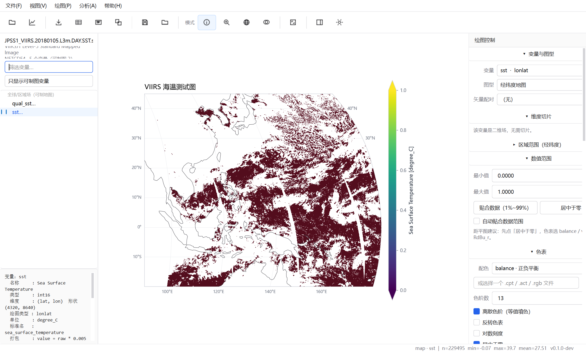
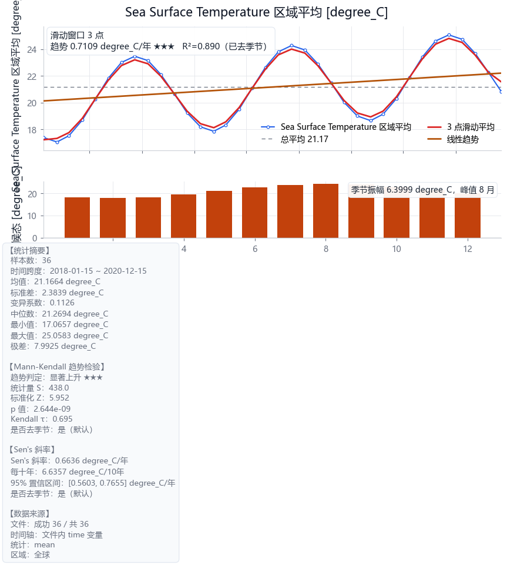
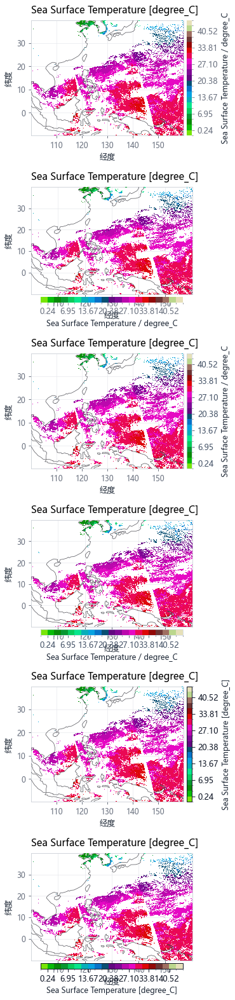

# NCSight · 海视

[](../../actions/workflows/tests.yml)
[](LICENSE)
[](pyproject.toml)

> 面向海洋遥感的 netCDF 可视化工作台
> 以 NASA [Panoply](https://www.giss.nasa.gov/tools/panoply/) 5.7.1 为设计蓝本，
> 按海洋遥感科研的实际工作流重写。

**为什么不用 Panoply**：全英文界面、无法脚本化、批处理能力弱、
大网格投影卡顿、掩膜与距平要靠外部工具。
NCSight 保留了 Panoply 最核心的那套「数据 → 切片 → 投影 → 色标 → 出图」
链路，补上了中文界面、脚本化、批处理和科研分析。



---

## 下载

**普通使用（推荐）** —— 到 **[Releases](../../releases)** 下载
`NCSight-<版本>-win64.zip`，解压后双击 `NCSight.exe`。
**不需要装 Python，也不需要 conda。**

```
NCSight/
├── NCSight.exe          ← 双击它，启动图形界面
├── ncsight-cli.exe      ← 命令行版，批量出图 / 批量分析
└── _internal/           ← 依赖、离线底图、出图预设（不能删、不能单独移动）
```

> `_internal` 必须和 exe 待在一起 —— 跟 Panoply 要求 jars 文件夹不能移动是一个道理。

**开发使用** —— 见下方「从源码运行」。

---

## 它解决什么问题

| 场景 | Panoply | NCSight |
|---|---|---|
| 界面语言 | 全英文 | 中文 |
| 一天几百个逐日文件 | 只能一个个开 | **一次全加进来，直接算趋势/季节/谱** |
| 出图可复现 | Export CL Script，较绕 | 一个 `PlotSpec` YAML，能进 git |
| 大网格（4320×8640） | 明显卡顿 | 屏幕按像素降采样，**13.4 秒 → 0.9 秒** |
| 掩膜 / 距平 / 合成 | 需外部工具 | 内置 |

---

## 两种用法

### 方式一：双击 exe（推荐，跟 Panoply 一样）

打包好的目录结构（与 Panoply 的 `exe + jars` 同构）：

```
NCSight/
├── NCSight.exe          ← 双击它，启动图形界面
├── ncsight-cli.exe      ← 命令行版，批量出图用
└── _internal/           ← 依赖、离线底图、出图预设（不能删、不能单独移动）
```

把它整个拷到桌面或任意位置，双击 `NCSight.exe`，然后
`文件 → 打开数据集…` 即可。**不需要装 Python，不需要装 conda。**

> `_internal` 必须和 exe 待在一起 —— 跟 Panoply 要求 jars 文件夹不能移动是一个道理。

### 方式二：从源码跑（开发用）

```bash
pip install -e ".[all]"
ncsight gui  data.nc          # 图形界面
ncsight plot data.nc -v sst -o sst.png   # 命令行
```

---

## 从源码打包成 exe

```bash
python scripts/build_exe.py           # 生成图标 + 打包 + 自动自检
python scripts/build_exe.py --clean   # 先清理再打包
```

产物在 `dist/NCSight/`。打包完成后会**自动跑一次 exe 自检**
（离屏把「Qt 插件 → 离线底图 → 打开数据 → 出图 → 存盘」整条链路验一遍），
比手工双击试错靠谱得多。也可以随时手动自检：

```bash
NCSight.exe --selftest  你的数据.nc
```

---

## 一分钟上手（源码方式）

```bash
# 环境（本项目固定使用这个 conda 环境）
D:\Anaconda_new\envs\py39gpu\python.exe

# 装依赖
pip install -e ".[all]"          # 或按需： pip install -e ".[geo,colormaps,gui]"

# 打开图形界面
ncsight gui  E:\bigcreation\NOAAVIRUSdata\JPSS1_VIIRS.20180105.L3m.DAY.SST.sst.4km.nc

# 或者完全不用界面，命令行出图
ncsight info  data.nc                                            # 看数据结构
ncsight plot  data.nc -v sst --projection Robinson -o sst.png    # 出图
ncsight batch ./ncdata -o ./figures --format pdf                 # 批量出图
```

---

## 核心设计：一个 PlotSpec 描述一张图

这是整个软件最重要的设计，也是它比 Panoply 好用的根本原因。

```python
PlotSpec(
    variable="sst",              # 画哪个变量
    kind="map",                  # 图型
    projection="Robinson",       # 投影
    bbox=[100, 180, -20, 45],    # 区域
    cmap="thermal", nbins=13,    # 色表与色阶
    center_zero=True,            # 居中于零（距平图）
    mask_land=True,              # 抹掉陆地
    overlays=OverlaySpec(coastline=True, resolution="50m"),
    preset="single",             # 单栏 8.3 cm（投稿）
    dpi=300,
)
```

**PlotSpec 可以无损存成 YAML**。于是：

| 能力 | 怎么实现 |
|------|----------|
| 一条命令重画同一张图 | `ncsight plot data.nc --spec sst.plot.yaml` |
| 图形界面与命令行完全一致 | 两者都调用同一个 `core.render()` |
| 出图参数进 git | `.plot.yaml` 是纯文本 |
| 批量出图 | 遍历一批 PlotSpec |

```bash
# 先生成一份配置模板，改完再复用
ncsight spec data.nc -v sst -o sst.plot.yaml
ncsight plot data.nc --spec sst.plot.yaml

# 想临时改一个参数？
ncsight plot data.nc --spec sst.plot.yaml --set nbins=9 --set projection=Mollweide

# 任何 PlotSpec 字段都能覆盖
ncsight plot data.nc --set overlays.rivers=true --set mask_range=[15,30]
ncsight options          # 列出全部可配置项
```

---

## 目录结构

```
ncsight/
├── ncsight/
│   ├── version.py            ★ 版本号唯一来源（绝不硬编码版本）
│   ├── style.py              matplotlib 白色简约主题 + 中文字体 + 期刊图幅
│   ├── config.py             PlotSpec / Session / 用户偏好 的读写
│   ├── cli.py                命令行入口
│   ├── core/                 ★ 内核：与 GUI 完全解耦
│   │   ├── detect.py           坐标轴与变量类型识别（NcVarTypeDetector）
│   │   ├── reader.py           数据读取 + packed 解包（NcDataset）
│   │   ├── colormap.py         色表：内嵌调色板/CPT/内置包（graphics.clut）
│   │   ├── grid.py             降采样、区域裁切、重采样（NcGridder）
│   │   ├── overlay.py          海岸线/国界/Shapefile 叠加
│   │   ├── mask.py             掩膜（M3）
│   │   ├── analyze.py          距平/合成/梯度（M3）
│   │   ├── export.py           图像与数据导出（M3）
│   │   ├── animate.py          沿维动画（M3）
│   │   ├── batch.py            批量出图（M3）
│   │   └── plot/               绘图内核
│   │       ├── base.py           ★ PlotSpec + 渲染调度
│   │       ├── map_plot.py       经纬度地图
│   │       ├── line_plot.py      折线/时间序列/纬向平均
│   │       ├── hovmoller.py      时间-经度/纬度
│   │       ├── section.py        垂直剖面
│   │       └── vector.py         矢量场
│   └── gui/                  PySide6 界面（可完全不装）
│       ├── app.py / theme.py / icons.py
│       ├── main_window.py    三栏主窗 + 防抖渲染
│       ├── plot_view.py      画布 + 取值/缩放/平移/圈选
│       ├── dialogs.py        导出/动画/批量/关于
│       └── panels/           数据 · 色标 · 地图 · 筛选分析 · 版式
├── scripts/release.py        版本发布辅助
├── tests/                    自包含测试（现场生成迷你 nc，不依赖真实数据）
├── CHANGELOG.md              更新日志（Keep a Changelog）
├── pyproject.toml
└── requirements.txt
```

### 唯一的架构铁律

> **`core/` 与 `style.py` 里绝对不允许 `import` 任何 GUI 库。**

这是 Panoply 没能做到（所以它难以自动化）而你**必须**做到的一点。
做到之后，界面出图和 `cli.py` 批处理出图调用的是同一个 `render()` 函数，
「所见即所得」和「批量出图」就同时成立了。

---

## 批量分析：一天几百个文件，直接出结论

逐日卫星产品动辄几百个文件。传统做法要写脚本循环读文件、算区域平均、
拼时间轴、再逐个算趋势 —— NCSight 把这一段做成了内置能力。

`文件 → 打开数据集…`（**可多选**）或 `文件 → 打开文件夹…` 把一批 nc 加进来，
左侧会列出数据集清单；再到「时序分析」面板勾选指标、点一下即可。

**时间轴自动识别**（三级兜底）：文件里的 `time` 变量 → 文件名的日期
（认 `20180105` / `2018-01-05` / `.2018005.` 年积日 / `201803` 年月）→ 样本序号。

**14 个内置科学指标**：线性趋势（含 95% 置信区间与 p 值）、Mann-Kendall 检验、
Sen's 斜率、季节循环、去季节、功率谱（FFT）、自相关、距平、累积距平、
滑动平均、变率与有效自由度、逐月距平、极值/超阈值、统计摘要。



> **所有趋势类指标默认先去季节**。这不是可选项：实测一条真值 +0.80 ℃/年、
> 季节振幅 3 ℃ 的 36 个月序列，直接拟合会得到 1.25 ℃/年（**偏高 57%**），
> 因为季节项的相位与时间项并不严格正交。去季节后回到 0.71。

命令行同样可以：

```bash
ncsight-cli.exe timeseries "E:\data\*.nc" -o trend.png \
    --indicators trend,mk,sen,seasonal,spectrum \
    --bbox 110 140 5 35 --stat mean
```

---

## 功能一览

### 读数据
- netCDF3/4（含 HDF5 容器）、GRIB、HDF4/5，远程 OPeNDAP URL 可直接打开
- **显式处理 packed 数据**（`scale_factor` / `add_offset` / `_FillValue`）
- 坐标轴与变量类型自动识别，单位/标准名/变量名三级容错
- **变量树按可绘图类型分组**，过滤三档（可制图 / 地理 / 全部）
- 自动选中「主变量」——不会像 Panoply 那样一打开就是 `qual_sst`

### 画图
| 图型 | 说明 |
|------|------|
| 经纬度地图 | 13 种投影、等值线、矢量场、底图叠加、区域裁切 |
| Hovmöller | 经度-时间 / 纬度-时间（季节内振荡、赤道波） |
| 垂直剖面 | 经纬度-深度，深度自动向下 |
| 折线 / 时间序列 | 含纬向平均廓线 |
| 矢量场 | U/V 自动配对，风场 / 流场 |

- 色表 70+ 内置（cmocean 海洋学 / cmcrameri 感知均匀 / matplotlib / ColorBrewer）
- **自动读取文件内嵌的 OBPG 调色板**（含交错存储的正确解码）
- 支持 `.cpt` / `.act` / `.rgb` / `.gct` 色表文件
- 色标：范围、色阶、反转、对数、居中于零、越界三角、自定义刻度
- **色标 6 种样式 × 4 个位置**可选（简洁 / 细边框 / 经典带框 / 极简 / 投影 / 分阶描边），
  越界三角默认「按数据是否真的越界」自动决定



- 图幅预设按期刊要求：单栏 8.3 cm / 双栏 17.1 cm

### 分析（M3）
- 掩膜：抹掉陆地、质量标记过滤、数值区间过滤、Shapefile 圈定研究区
- 沿任意维度合成（mean/min/max/std/median）
- 距平（相对气候态或自身时间平均）
- U/V 矢量合成、高斯平滑、梯度强度（锋面检测）
- 区域平均时间序列

### 导出
- 图像：PNG / JPEG / TIFF / **PDF / SVG / EPS**（矢量，投稿用）
- 数据：CSV / NPZ / 带表头文本 / 数据集结构说明
- 动画：MP4（需 ffmpeg）/ GIF（纯 Python）
- 一键复制到剪贴板
- 绘图配置 `.plot.yaml`（可进版本管理）

---

## 版本管理

三处版本信息由脚本统一维护，从流程上杜绝「代码是 0.4.0、
CHANGELOG 是 0.3.1、git tag 还是旧的」这种灾难：

```bash
python scripts/release.py show              # 看当前版本与 tag
python scripts/release.py bump patch        # 0.3.0 -> 0.3.1
python scripts/release.py bump minor --commit   # 升版 + 滚动 CHANGELOG + 提交 + 打 tag
python scripts/release.py check             # 一致性自检
```

- **唯一来源**：`ncsight/version.py` 的 `__version__`（`pyproject.toml` 动态读取它）
- **CHANGELOG**：Keep a Changelog 格式，`[Unreleased]` 段落由脚本自动落到版本号下
- **git**：每个里程碑一个 tag（`v0.1.0` = M1，`v0.2.0` = M2，`v0.3.0` = M3）
- 提交信息建议用 [Conventional Commits](https://www.conventionalcommits.org/)：
  `feat:` / `fix:` / `refactor:` / `docs:` / `test:` / `release:`

---

## 测试

```bash
python -m pytest -q
```

测试**不依赖任何真实数据文件** —— `tests/conftest.py` 会现场生成一个
「迷你 VIIRS」风格的小 nc，里面刻意包含本项目踩过的所有坑：

- int16 packed 数据（`scale_factor` / `add_offset` / `_FillValue`）
- OBPG 风格的**交错存储** `palette` 变量
- 纬度递减（与真实 L3 产品一致）
- 完整的 CF 属性

所以这几个最容易出错的点都被回归测试钉住了。

---

## 已知限制

- 曲线网格（swath）目前只做直出，未走正式重采样（计划接 `pyresample`）
- `.cpt` 解析未支持带 alpha 通道的分段型
- 动画建议帧数控制在数百帧以内
- 掩膜运算随格点数增长，建议先设定「区域范围」再打掩膜

## 与 Panoply 的对应关系

完整的逐模块对照见工作区根目录的 `Panoply拆解报告.html`。
简表：

| Panoply | NCSight |
|---------|---------|
| netCDF-Java | `netCDF4` + `xarray` |
| `NcVarTypeDetector` | `core/detect.py` |
| `NcDataset` / `NcDataWrapper` | `core/reader.py` |
| `NcGridder*` | `core/grid.py` |
| `graphics.clut` | `core/colormap.py` |
| `map.proj`（287 个类） | `cartopy` + `pyproj` |
| `map.overlay` / `shapefile` | `core/overlay.py` |
| `PanLonLatPlot` 等 56 个绘图类 | `core/plot/*.py` |
| `PlotMeta` / `SavedSettings` | `PlotSpec` + `config.py` |
| `PanoplyCL` | `cli.py` |
| Swing 界面（600+ 类） | `gui/`（PySide6，约 10 个文件） |

---

## 许可

本项目自身代码以 **MIT** 发布 —— 见 [LICENSE](LICENSE)。

但**发布打包好的 exe 时**，随包分发的第三方库有各自的许可，其中
**PySide6（Qt）与 cartopy 是 LGPL-3.0**，需要遵守「可重新链接」等要求。
本项目采用 onedir 打包（依赖是独立的 `.dll`/`.pyd` 文件，用户可直接替换），
已满足这一条；完整的组件清单与合规说明见 **[THIRD_PARTY.md](THIRD_PARTY.md)**。

> 如果你需要**完全不受 LGPL 约束**的版本：NCSight 的核心与命令行版
> **完全不依赖 Qt**（`tests/test_purity.py` 会持续验证这条约束），
> 可以只使用 `ncsight-cli.exe`。

---

## 引用

如果这个工具帮到了你的研究，可以在论文里这样写：

> 数据处理与可视化使用 NCSight（https://github.com/USERNAME/ncsight）。

配色方案建议一并引用其原始作者：

- Thyng, K. M., Greene, C. A., Hetland, R. D., Zimmerle, H. M., & DiMarco, S. F. (2016).
  True colors of oceanography. *Oceanography*, 29(3), 10.
- Crameri, F. (2018). Scientific colour maps. *Zenodo*.
  https://doi.org/10.5281/zenodo.1243862

---

## 参与开发

```bash
git clone https://github.com/USERNAME/ncsight.git
cd ncsight
pip install -e ".[all]"      # 全套依赖（含界面、投影、分析）
python -m pytest -q          # 测试不依赖任何真实数据文件
```

提交信息建议用 [Conventional Commits](https://www.conventionalcommits.org/)
（`feat:` / `fix:` / `docs:` / `test:` / `release:`）。

CI 会在 Linux 与 Windows、Python 3.10 与 3.12 上跑测试，并检查一条硬约束：
**`ncsight/core/` 不得依赖 GUI 库** —— 否则命令行版在服务器 / 超算上就跑不了。
